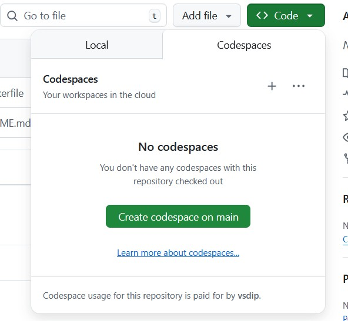
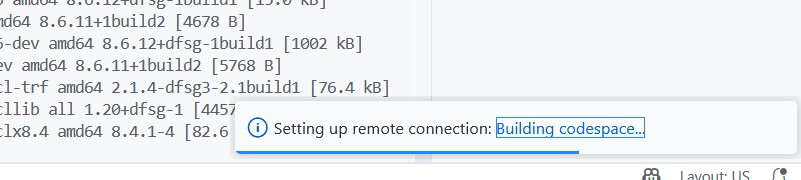
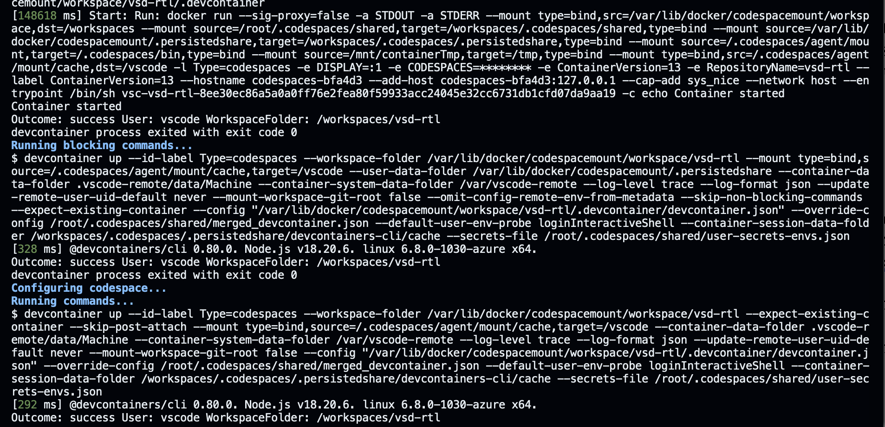
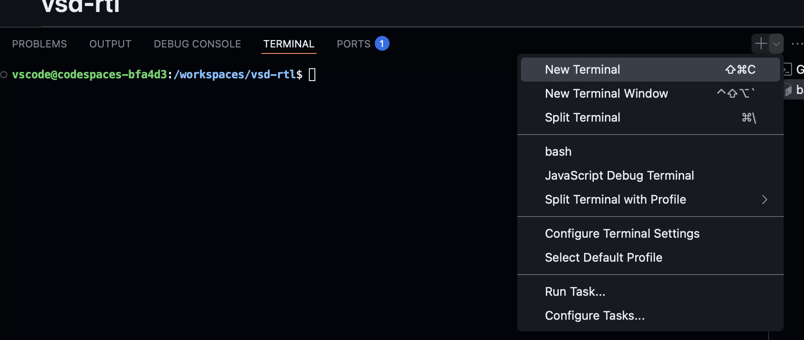
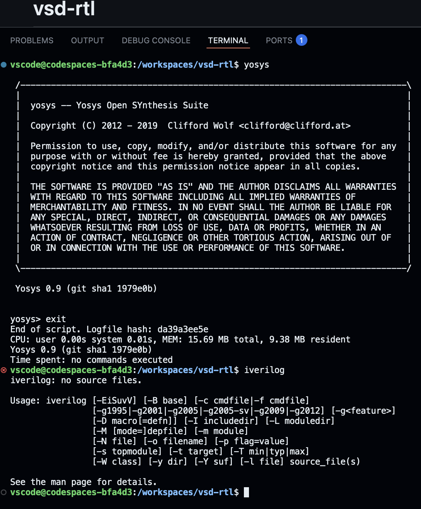
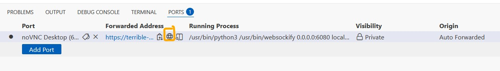
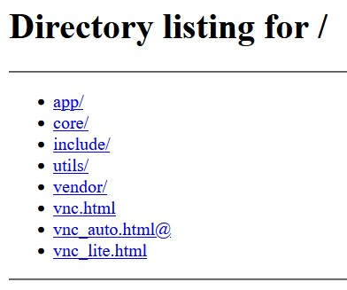
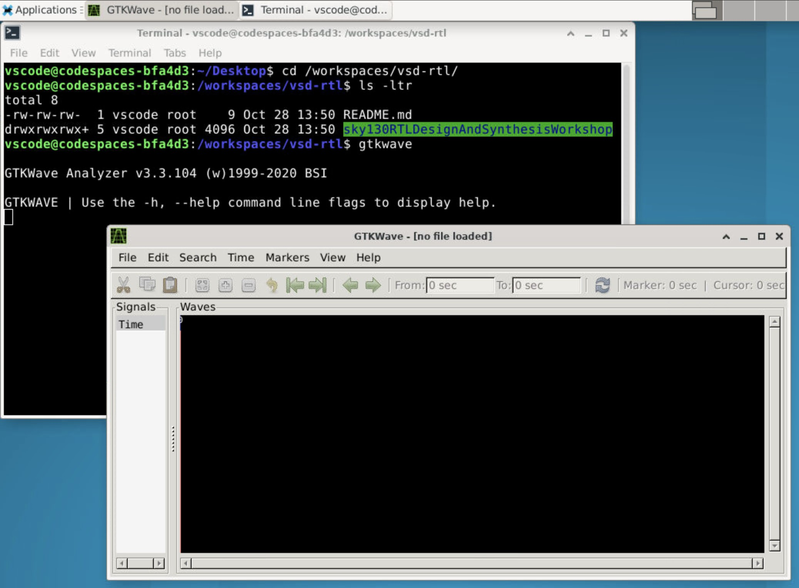

## RTL Design & Synthesis on Cloud (GitHub Codespace)

This repository provides a ready-to-use **cloud-based lab** for RTL Design and Synthesis using open-source tools such as **Yosys**, **Icarus Verilog**, and **GTKWave**.
All tools run inside a **GitHub Codespace** with **noVNC desktop access**, requiring no local installation.

---

### Step 1 – Launch Codespace

Click **“Code → Codespaces → Create codespace on main”** to start your workspace on the cloud.
GitHub will automatically build and set up your environment.



---

### Step 2 – Codespace Setup and Logs

During setup, the Codespace installs all required tools.
Wait for the setup logs to complete (approximately 7–10 minutes).



After successful configuration, your container environment is ready.



---

### Step 3 – Open a Terminal

Use **Terminal → New Terminal** inside VS Code to begin executing synthesis and simulation commands.



---

### Step 4 – Verify Tool Installation

Run the following commands to verify tool installation:

```bash
yosys
iverilog
```

Both should display their version information, confirming correct setup.



---

### Step 5 – Launch noVNC Desktop

Go to the **Ports** tab and click the **globe icon** next to the forwarded port (6080) to open the desktop environment in your browser.



---

### Step 6 – Access VNC Interface

In the directory listing, select `vnc_lite.html` to open a lightweight graphical desktop.



---

### Step 7 – Run Workshop Files and GTKWave

Navigate to your workspace folder and open GTKWave to analyze waveform outputs:

```bash
cd /workspaces/vsd-rtl/
ls
gtkwave
```



---

### Summary

Your cloud lab is now fully set up.
You can perform RTL design, synthesis, simulation, and waveform analysis directly from your browser, without installing any local software.

---

**Repository:** [vsdip/vsd-rtl](https://github.com/vsdip/vsd-rtl)
**Maintained by:** VLSI System Design (VSD)
